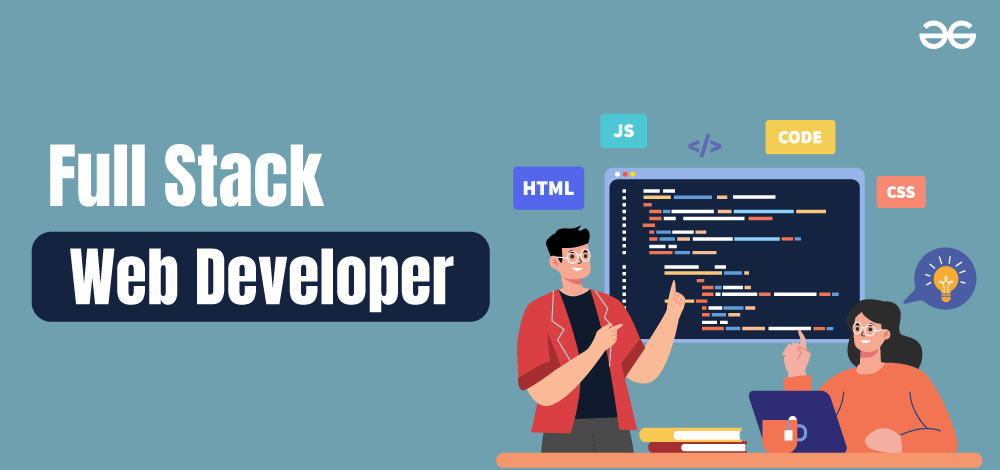

  

<h1 align="center">Hi 👋, I'm Md Rahmat Ali</h1>

 

###
🚀 Full-Stack Developer | HTML | CSS | JavaScript | React
###
<h3 align="center">I am a MERN Stack Developer with a strong foundation in HTML, CSS, and JavaScript. Passionate about creating responsive and user-friendly web interfaces, I focus on writing clean, efficient code and continuously expanding my web development skills.</h3>

- 🌱 I’m currently learning **React**
- 💬 Ask me about **HTML, CSS, JavaScript**

- 📫 How to reach me **developer.rahmat15@gmail.com**

- ⚡ Fun fact **If brain is not equal to empty!!! then keep coding else order a coffee.**

<h3 align="left">Connect with me:</h3>

## 👨‍💻 Tech Stack I am Familiar With

 
 

 
 

<!-- 

 
 
 
 
 
 
 
 
 
 
  -->

 

   

      
   

<table>
 <tr>
   <td>
   
   
   
   </td>

  <td>

  
  </td>

 </tr>
</table>
